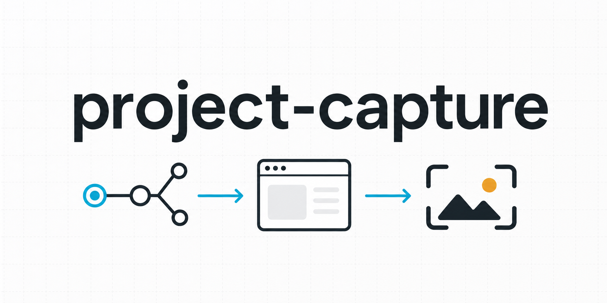

# Project Capture



[English README](README.md)

[](https://www.npmjs.com/package/project-capture)
[](LICENSE)

Project Capture는 웹 프로젝트를 분석하고, 화면 후보를 찾고, 캡처 범위와 로그인 방식을 사용자에게 확인한 뒤, Playwright로 선택된 화면을 캡처하는 Codex 스킬입니다.

이 스킬은 “모든 화면을 무조건 자동 캡처”한다고 주장하지 않습니다. 동적 라우트, 인증이 필요한 화면, 권한별 화면, feature flag 화면, 숨겨진 UI 상태는 사용자 확인이나 샘플 URL이 필요할 수 있습니다.

## 주요 기능

- 프로젝트 구조와 프레임워크 단서 분석
- Next.js, Remix, React Router, 일반 SPA 패턴의 라우트 후보 탐색
- 캡처 전 로그인/보호 라우트 단서 확인
- 전체, 핵심 도메인, 특정 도메인, 수동 지정 범위 선택
- 샘플이 있는 동적 라우트 처리
- 수동 로그인, 환경변수 로그인, 공개 화면만 캡처 지원
- Playwright 기반 화면 캡처
- 전체 스크롤 길이 캡처 또는 보이는 viewport만 캡처 지원
- Markdown 리포트와 JSON 결과 파일 생성

## 저장소 구조

```text
project-capture/
├── package.json
├── bin/
│   └── cli.js
├── SKILL.md
├── README.md
├── README.ko.md
├── LICENSE
├── assets/
│   └── project-capture-banner-simple.png
├── references/
│   ├── auth-handling.md
│   └── route-discovery.md
└── scripts/
    ├── capture_pages.mjs
    └── discover_routes.py
```

## 설치

### npx 사용

현재 프로젝트에 스킬을 설치합니다.

```bash
npx project-capture init
```

이 명령은 스킬을 아래 경로로 복사합니다.

```text
.codex/skills/project-capture/
.claude/skills/project-capture/
```

또한 기존 `AGENTS.md`, `CLAUDE.md`, `GEMINI.md`, `.cursorrules` 파일 중 하나에 project-capture 사용 지침을 추가합니다. 해당 파일이 없으면 `AGENTS.md`를 생성합니다.

Codex 글로벌 스킬로 설치하려면 다음 명령을 사용합니다.

```bash
npx project-capture init --global-codex
```

특정 로컬 에이전트 디렉터리에만 설치할 수도 있습니다.

```bash
npx project-capture init --agent codex
npx project-capture init --agent claude
```

### Codex 수동 설치

이 디렉터리를 Codex 글로벌 스킬 경로로 복사합니다.

```bash
cp -R project-capture ~/.codex/skills/project-capture
```

그다음 새 Codex 세션을 시작하면 스킬 메타데이터가 로드됩니다.

## Codex 외 환경에서 사용

Project Capture는 Codex 스킬 형식으로 패키징되어 있지만, 핵심 기능은 독립 실행 가능한 스크립트로 구현되어 있습니다. Claude Code, Gemini CLI, 커스텀 터미널 에이전트 같은 다른 AI 코딩 도구에서도 `SKILL.md`의 워크플로우를 읽고 스크립트를 직접 실행하는 방식으로 사용할 수 있습니다.

권장 에이전트 지시문:

```text
이 저장소를 프로젝트 화면 캡처 도구로 사용하세요. 먼저 scripts/discover_routes.py로 대상 웹 프로젝트를 분석하고, 라우트 후보를 요약한 뒤, 캡처 범위를 사용자에게 질문하세요. 보호 라우트가 감지되면 로그인 방식을 질문하고, 이후 scripts/capture_pages.mjs를 Playwright로 실행해 스크린샷과 리포트를 저장하세요.
```

최소 실행 흐름:

```bash
npx project-capture discover /path/to/project \
  --output /path/to/project/output/playwright/project-capture-routes.json

npx project-capture capture \
  --base-url http://localhost:3000 \
  --routes /path/to/project/output/playwright/project-capture-routes.json \
  --scope core \
  --screenshot-mode viewport \
  --viewport 1440x900 \
  --output-dir /path/to/project/output/playwright/project-capture
```

Codex가 아닌 에이전트에서는 `SKILL.md`를 운영 가이드로, `references/`를 보조 정책 문서로, `scripts/`를 실제 실행 구현으로 보면 됩니다.

## 일반 사용 흐름

1. Codex에 `project-capture`, `/capture`, 또는 프로젝트 화면 캡처를 요청합니다.
2. Codex가 프로젝트를 분석하고 라우트 후보를 찾습니다.
3. Codex가 캡처 범위를 질문합니다.
4. 보호 라우트가 감지되면 로그인 처리 방식을 질문합니다.
5. 스크린샷 방식을 `fullpage` 또는 `viewport` 중에서 질문합니다.
6. 선택된 화면을 캡처합니다.
7. 생성된 리포트를 요약합니다.

## 캡처 범위

스킬은 캡처 전에 사용자에게 범위를 선택하게 합니다.

- `all`: 발견된 정적 라우트 전체
- `core`: 홈, 로그인, 대시보드, 설정, 목록/상세/등록/수정 등 핵심 화면
- `domain`: `/admin`, `/users`, `/settings` 같은 특정 prefix 하위 화면
- `manual`: 사용자가 직접 지정한 URL 또는 path 목록
- `custom`: 그 외 사용자 정의 조건

## 스크린샷 방식

Project Capture는 두 가지 스크린샷 방식을 지원합니다.

```bash
--screenshot-mode fullpage
```

전체 스크롤 길이를 캡처합니다.

```bash
--screenshot-mode viewport --viewport 1440x900
```

선택한 화면 크기에서 보이는 viewport만 캡처합니다.

## 인증 처리

로그인이 감지되면 스킬은 아래 방식 중 하나를 질문합니다.

- `manual`: headed 브라우저를 열고 사용자가 직접 로그인
- `env`: `CAPTURE_USER`, `CAPTURE_PASSWORD`와 선택자 환경변수 사용
- `none`: 공개 화면만 캡처

OAuth, SSO, WebAuthn, CAPTCHA, SMS OTP, 이메일 OTP는 수동 로그인을 권장합니다.

## 스크립트 사용 예시

라우트 탐색:

```bash
npx project-capture discover /path/to/project --output output/playwright/project-capture-routes.json
```

핵심 라우트 캡처:

```bash
npx project-capture capture \
  --base-url http://localhost:3000 \
  --routes output/playwright/project-capture-routes.json \
  --scope core \
  --screenshot-mode viewport \
  --viewport 1440x900 \
  --output-dir output/playwright/project-capture
```

수동 로그인:

```bash
npx project-capture capture \
  --base-url http://localhost:3000 \
  --routes output/playwright/project-capture-routes.json \
  --scope static \
  --auth-mode manual \
  --login-path /login \
  --headed \
  --output-dir output/playwright/project-capture
```

## 결과물

```text
output/playwright/project-capture/
├── screenshots/
├── capture-report.md
├── capture-results.json
└── storage-state.json
```

`storage-state.json`에는 민감한 세션 정보가 포함될 수 있으므로 커밋하지 마세요.

## 한계

- 라우트 탐색은 정적 분석 기반의 best-effort입니다.
- 런타임에만 생성되는 메뉴나 feature flag 화면은 발견되지 않을 수 있습니다.
- 동적 라우트는 샘플 값이 필요합니다.
- 여러 권한/계정을 자동 순회하지 않습니다.
- 시각적 회귀 테스트를 수행하지 않습니다.

## 배너

`assets/project-capture-banner-simple.png` 배너는 이 저장소를 위해 `imagegen` 스킬로 생성했습니다. 라우트 탐색, 브라우저 캡처, 스크린샷 결과 흐름을 직관적으로 전달하는 용도입니다.
